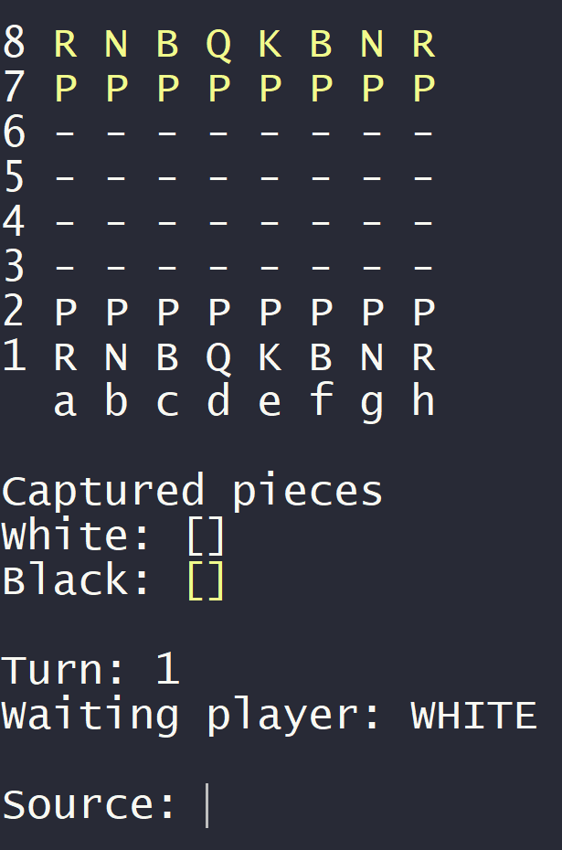
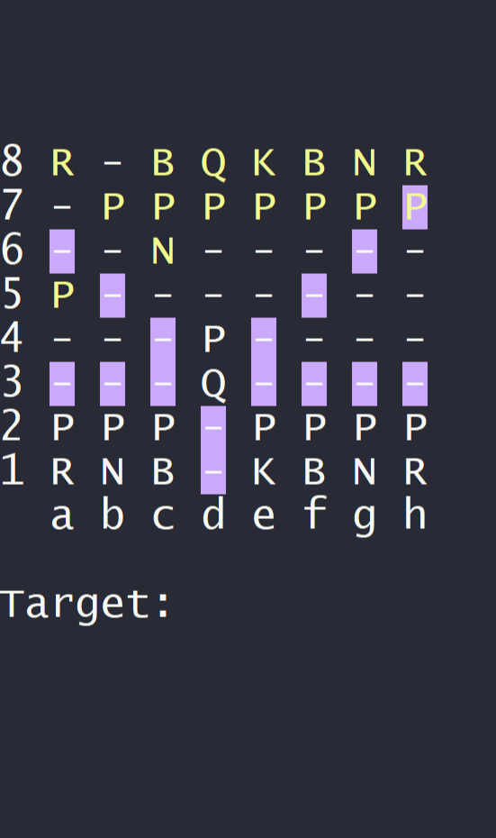
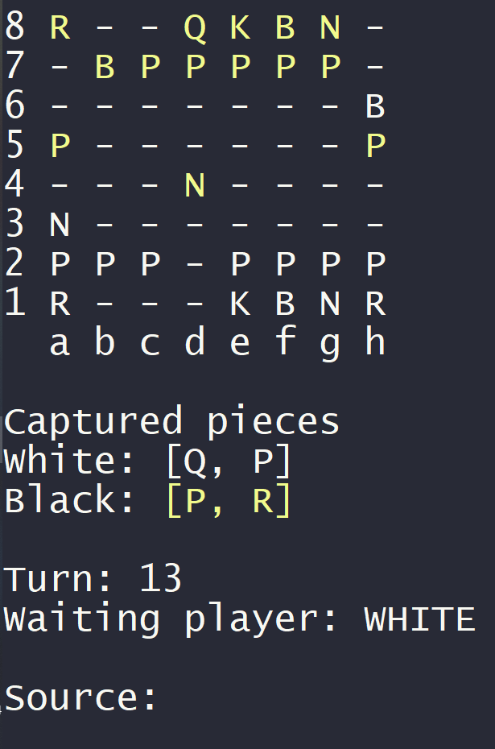

#Projeto ChessSystem


Um sistema de jogo de xadrez criado com o curso da Udemy ♟️

## 💻 Funcionalidades do projeto

- Escolha de peças e time
- Marcação de áreas de movimento
- Jogadas Especiais
- 

## ▶️ Demonstração





```
Execução pelo git bash
```

## 🟢 Rodar

```
Faça o download da past zip do projeto no github e rode com a sua IDE de preferência!
```

## ⌨️ Tecnologia Utilizada
- [Java](https://www.oracle.com/br/java/technologies/downloads/#jdk21-windows)