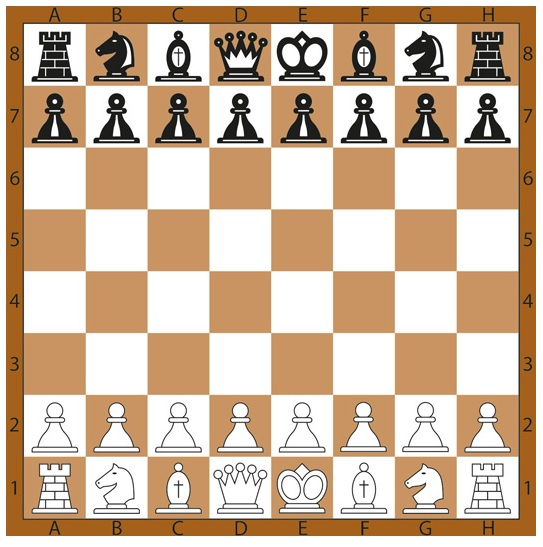
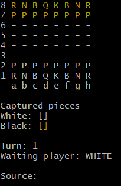

#Projeto ChessSystem


Um sistema de jogo de xadrez ♟️

## índice
- <a href="#funcionalidade">Funcionalidades do Projeto</a>
- <a href="#demonstracao">Demonstração</a>
- <a href="#rodar">Como rodar esse projeto</a>
- <a href="#tecnologia">Tecnologia Utilizada</a>

## 💻 Funcionalidades do projeto

- [x] Clássico jogo de xadrez
- [x] Jogadas Especiais

## ▶️ Demonstração




```
Execução pelo git bash
```

## 🟢 Rodar

```
Faça o download da past zip do projeto no github e rode com a sua IDE de preferência!
```

## ⌨️ Tecnologia Utilizada
- [Java](https://www.oracle.com/br/java/technologies/downloads/#jdk21-windows)